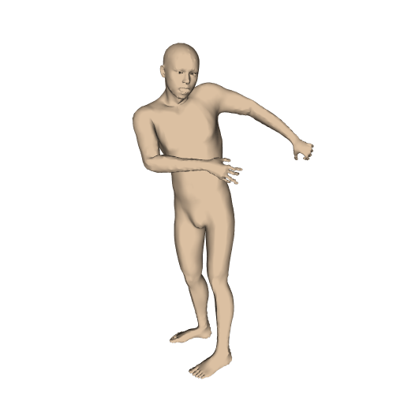
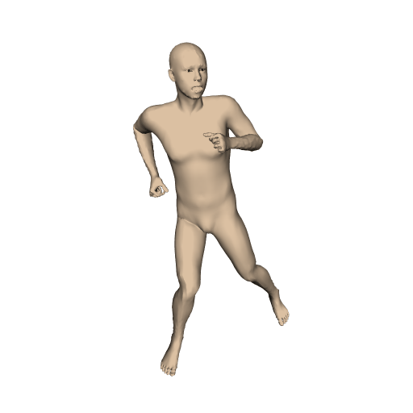
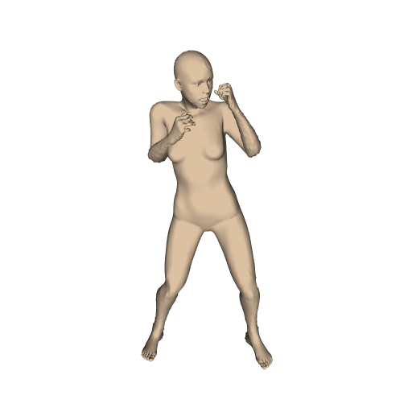
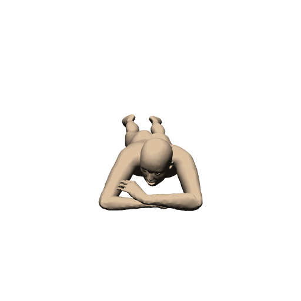
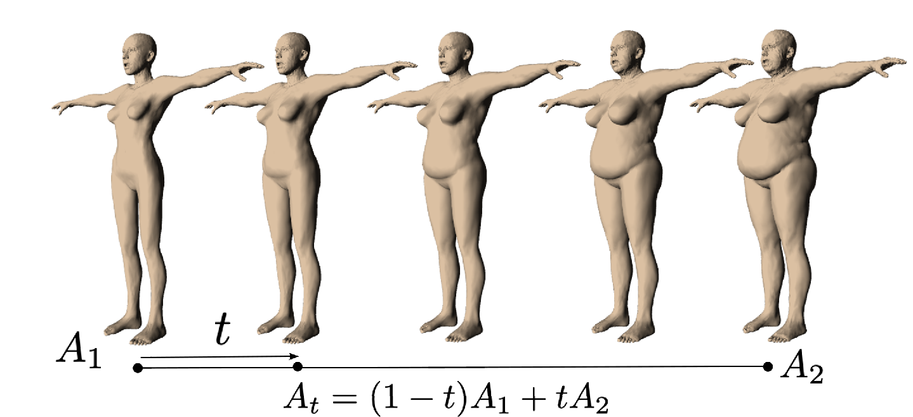
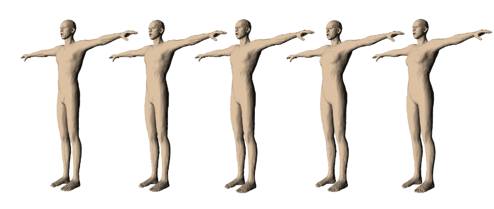
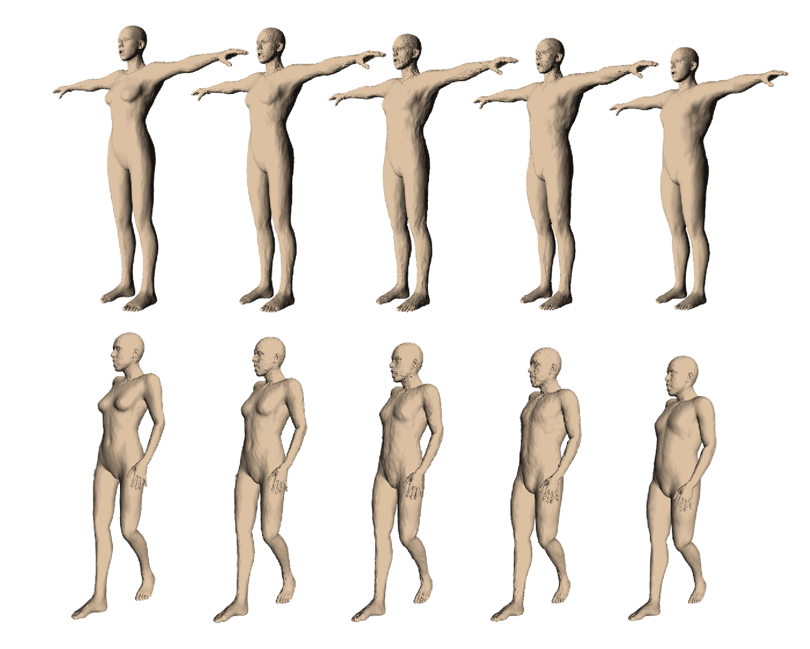
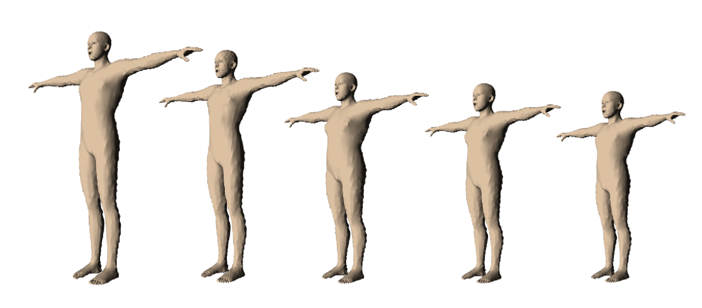
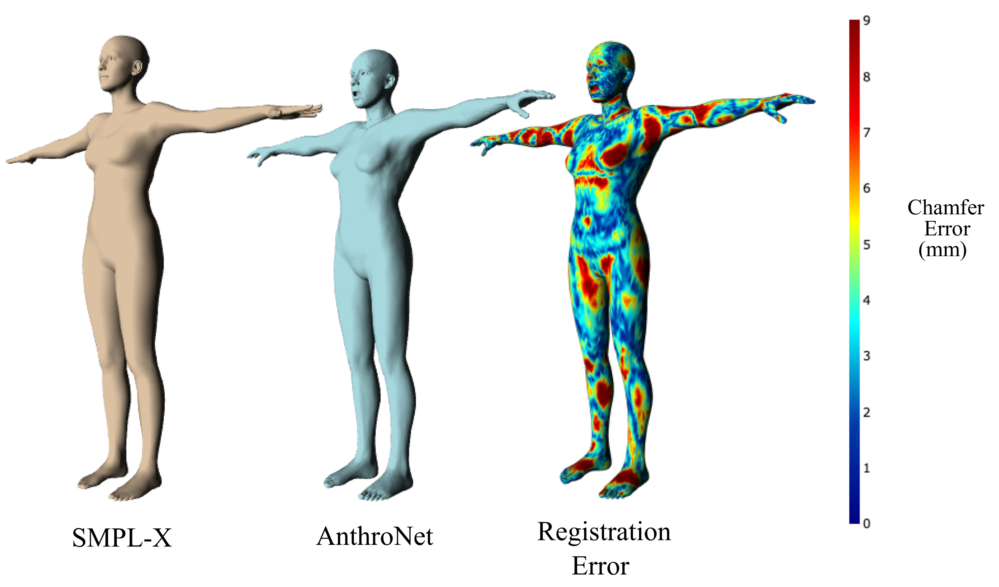
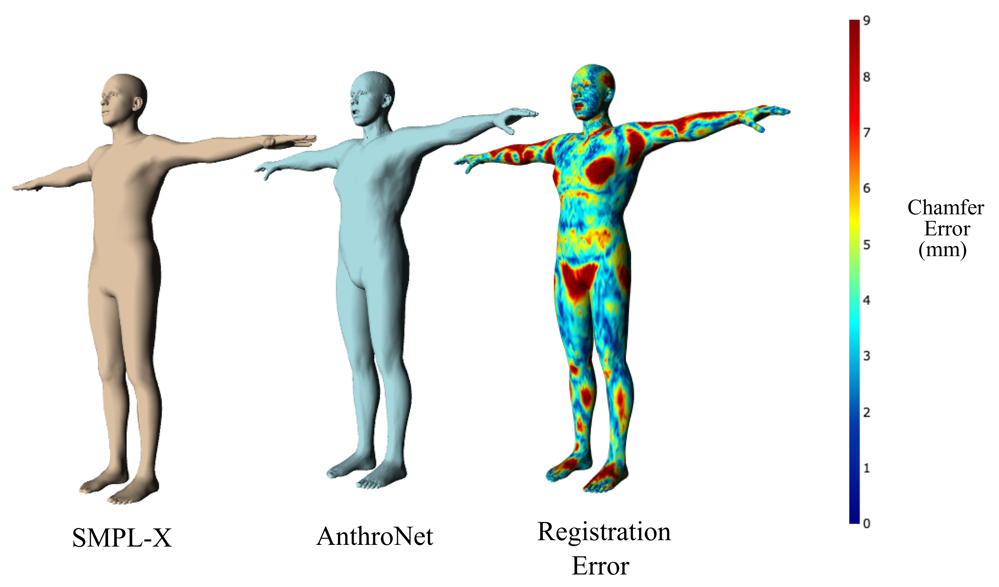

# AnthroNet: Conditional Generation of Humans via Anthropometrics

<p align="left">
  
  
  
</p>

<p align="center">
  
</p>

<p align="center">
  <a href="https://arxiv.org/submit/4771091/view" style="font-size:25px; text-decoration: none"><b>Paper</b></a>
  &nbsp; &nbsp;
  <a href="https://github.com/Unity-Technologies/com.unity.cv.synthetichumans" style="font-size:25px; text-decoration: none"><b>Source Code</b></a>
</p>

<p align="center">
  
  <br>
  <sub><b>AnthroNet with Poses.</b> The figure shows posed meshes obtained by applying LBS to generated meshes on 
    conditionals computed by piece-wise linear interpolation between four sets of full anthropometric 
    measurements ($A_1$, $A_2$, $A_3$, $A_4$).</sub>
</p>

<HR>

<p align="center">
  <a href="https://it.linkedin.com/in/francesco-picetti">Francesco Picetti</a>, 
  <a href="https://www.linkedin.com/in/shrinath-deshpande-24344876">Shrinath Deshpande</a>, 
  <a href="https://www.linkedin.com/in/jonathan-leban-21663a181">Jonathan Leban</a>, 
  <a href="https://ca.linkedin.com/in/soroosh-shahtalebi">Soroosh Shahtalebi</a>, 
  <a href="https://www.linkedin.com/in/jaylo-patel">Jay Patel</a>, 
  <br>
  <a href="https://www.linkedin.com/in/peifeng-jing">Peifeng Jing</a>, 
  <a href="https://ca.linkedin.com/in/chunpu-wang-b1a0a9b7/">Chunpu Wang</a>,
  <a href="https://www.linkedin.com/in/charles-metze-iii-1aa52021">Charles Metze III</a>, 
  <a href="https://www.linkedin.com/in/suncameron">Cameron Sun</a>, 
  <br>
  <a href="https://www.linkedin.com/in/ceralaidlaw">Cera Laidlaw</a>, 
  <a href="https://www.linkedin.com/in/jameswarren3d">James Warren</a>, 
  <a href="https://ca.linkedin.com/in/kathy-huynh-202218162/en">Kathy Huynh</a>, 
  <a href="https://www.linkedin.com/in/makinggames">River Page</a>, 
  <br>
  <a href="https://www.linkedin.com/in/jonathan-hogins-1952b919">Jonathan Hogins</a>, 
  <a href="https://www.linkedin.com/in/adam-crespi-81b1287">Adam Crespi</a>,
  <a href="https://www.linkedin.com/in/sujoy-ganguly-504b878">Sujoy Ganguly</a>,
  <a href="https://www.linkedin.com/in/saleheerfanianebadi">Salehe Erfanian Ebadi</a>
  <br>
  <b>Unity Technologies</b>
</p>


## Animated AnthroNet Examples

<p align="center">
  
  
  
  
  
<br>
  
  
  
  
  
<br>
  
  
  
  
  
</p>


## Abstract
We present a novel human body model formulated by an extensive set of anthropocentric measurements, which is capable of 
  generating a wide range of human body shapes and poses. The proposed model enables direct modeling of specific human 
  identities through a deep generative architecture, which can produce humans in any arbitrary pose. It is the first of 
  its kind to have been trained end-to-end using only synthetically generated data, which not only provides highly 
  accurate human mesh representations but also allows for precise anthropometry of the body. Moreover, using a highly 
  diverse animation library, we articulated our synthetic humans' body and hands to maximize the diversity of the 
  learnable priors for model training. Our model was trained on a dataset of 100k procedurally-generated posed human 
  meshes and their corresponding anthropometric measurements. Our synthetic data generator can be used to generate 
  millions of unique human identities and poses for non-commercial and academic research purposes.


## Summary
* AnthroNet provides a novel expressive high resolutions model of human body shape conditioned on anthropomorphic 
    measurements.
* AnthroNet offers two efficient registration pipelines that enable a bi-directional conversion of SMPL and SMPL-X 
    meshes into AnthroNet meshes.
* Our synthetic data generator which can produce high resolution meshes with their associated metadata is publicly 
    available for non-commercial and academic research use.


## Model Architecture
<p align="center">
  
  <br>
  <sub><b>AnthroNet's end-to-end trainable pipeline.</b>
    We discard the Mesh Encoder in the Mesh Generator block at inference time. Then we decode the estimated mesh in the 
    bind pose $\tilde{\mathcal{X}}^A_b$A using a latent vector $Z$ sampled from a normal distribution combined with the 
    encoded anthropometric measurements $A$. The mesh Skinner and Poser block predicts the pose and shape corrective 
    offsets $\Delta \tilde{\mathcal{X}}^A_{\bar{\theta}}$ required to animate the mesh into the desired pose 
    $\bar{\theta}$ and produce a fully skinned, rigged, and posed mesh $\tilde{\mathcal{X}}^A_{\bar{\theta}}$ with 
    the provided measurements $A$.</sub>
</p>


## Posed Synthetic Humans Dataset
<p align="center">
  <a href="https://github.com/Unity-Technologies/com.unity.cv.synthetichumans"></a>
  <br>
  <sub><b>Examples from our multi-subject and multi-pose synthetic dataset.</b>
    <a href="https://github.com/Unity-Technologies/com.unity.cv.synthetichumans">Our synthetic data generator</a>
    is publicly available for academic research and can be used to create millions of 
    unique human identities in arbitrary poses provided by the user.</sub>
</p>


## Interpolations
Human meshes generated by AnthroNet conditioned on measurements and sex. As depicted in the first figure, a mesh is 
  generated using conditional $A_t$, which is obtained from the linear interpolation between two measurement vectors 
  ($A_1$, $A_2$).

<p align="center">
  
  <br>
  <sub>Lean to curvy; keeping the same height and sex.</sub>
  <HR>
</p>

<p align="center">
             
  <br>
  <sub>Male to female; keeping the same anthropometric measurements.</sub>
  <HR>
</p>

<p align="center">
  
  <br>
  <sub>Tall female to short male.</sub>
  <HR>
</p>

<p align="center">
  
  <br>
  <sub>Tall to short; same sex and chest-to-waist circumference ratio.</sub>
</p>


## Registration Error
<p align="center">
  
  
  <br>
  <sub><b>Illustration of Registration Error when AnthroNet is fitted to a SMPL-X mesh.</b>
    A large portion of error attributes are due to the fact that SMPL-X meshes are registered on humans wearing tight 
    clothing, whereas our synthetic humans are without clothes.</sub>
</p>


## Citation
```
@inproceedings{picetti2023anthronet,
      title={AnthroNet: Conditional Generation of Humans via Anthropometrics},
      author={Picetti, Francesco and Deshpande, Shrinath and Leban, Jonathan and Shahtalebi, Soroosh and Patel, Jay and 
              Jing, Peifeng and Wang, Chunpu and Metze III, Charles and Sun, Cameron and 
              Laidlaw, Cera and Warren, James and Huynh, Kathy and Page, River and 
              Hogins, Jonathan and Crespi, Adam and Ganguly, Sujoy and Erfanian Ebadi, Salehe},
      year={2023},
      eprint={4771091},
      archivePrefix={arXiv},
      primaryClass={cs.CV}
}
```

## Related links
- [Unity's Perception Package: Perception toolkit for sim2real training and validation in Unity](https://github.com/Unity-Technologies/com.unity.perception)
- [Unity Synthetic Humans: A package for creating Unity Perception compatible synthetic people](https://github.com/Unity-Technologies/com.unity.cv.synthetichumans/)
- [PeopleSansPeople: Unity's privacy-preserving human-centric synthetic data generator](https://github.com/Unity-Technologies/PeopleSansPeople)
- [Unity Computer Vision](https://unity.com/products/computer-vision)


## License
AnthroNet is licensed under a NON-COMMERCIAL SOFTWARE LICENSE AGREEMENT. See [LICENSE](LICENSE.md) for the full license text.
